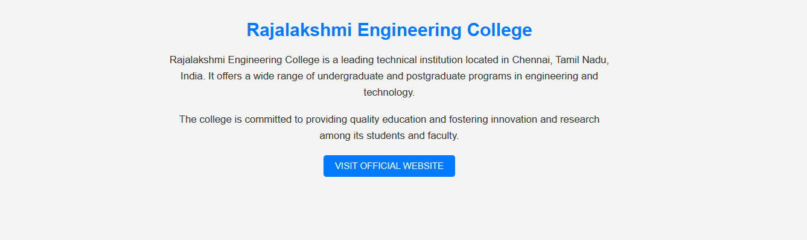
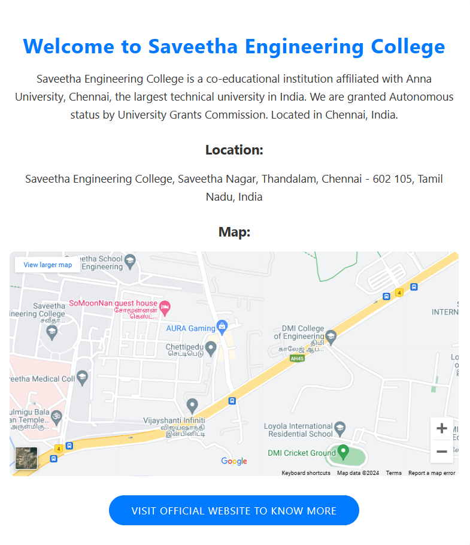
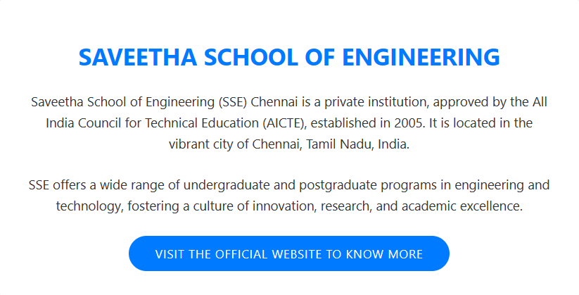
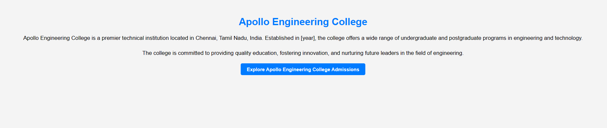
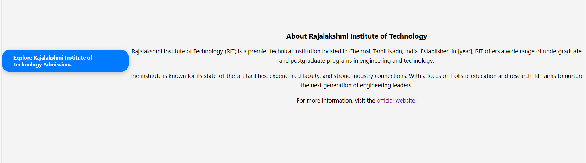
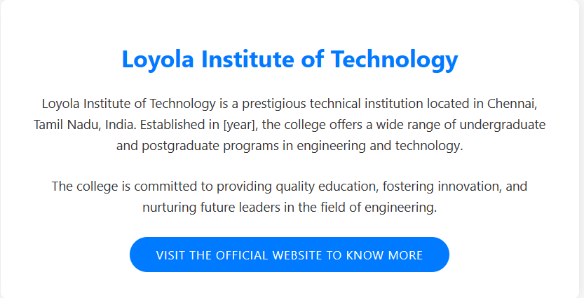

# Ex04 Places Around Me
## Date: 14/04/2024


## AIM
To develop a website to display details about the places around my house.

## DESIGN STEPS

### STEP 1
Create a Django admin interface.

### STEP 2
Download your city map from Google.

### STEP 3
Using ```<map>``` tag name the map.

### STEP 4
Create clickable regions in the image using ```<area>``` tag.

### STEP 5
Write HTML programs for all the regions identified.

### STEP 6
Execute the programs and publish them.

## CODE:
map.html
```
<!DOCTYPE html>
<html lang="en">
<head>
    <title>Image Coordinates Finder</title>
    <style>
        #image-container {
            position: relative;
        }
        #coordinates {
            position: absolute;
            top: 0;
            left: 0;
            padding: 10px;
            background-color: rgba(255, 255, 255, 0.7);
        }
    </style>
</head>
<body>
    <h1 align="center">
        <font color="red"><b>Colleges Around Me</b></font>
    </h1>
    <h3>
        <center>
        <font color="blue"><b>T.KAVINAJAI (212223100020)</b></font>
        </center>
    </h3>
    <center>
        <div id="image-container">
            
            <div id="coordinates"></div>
        </div>
        <map name="college">
            <area shape="poly" coords="678,472 657,488 625,489 622,478" href="1.html" title="Kings Engineering College">
            <area shape="poly" coords=" 829,  387 , 850, 391 , 898, 389 ,866, 381" href="6.html"title="RAJALAKSHMI ENGINEERING COLLEGE">
            <area shape="poly" coords="965,203 940,235 964,235 1001,243" href="3.html" title="SAVEETHA ENGINEERING COLLEGE">
            <area shape="poly" coords=" 1036,182, 996, 175 ,1015, 177 ,1057, 183" href="4.html" title="SAVEETHA SCHOOL OF ENGINEERING">
            <area shape="poly" coords=" 938,  88 ,1009, 83 , 1025, 86, 16, 118" href="5.html" title="APOLLO ENGINEERING COLLEGE">
            <area shape="poly" coords="1248,86 1299,78 1301,91 1352,78" href="rit.html" title="RAJALAKSHMI INSTITUTE OF TECHNOLOGY">
            <area shape="poly" coords="1187,224 1184,214 1159,217 1137,220" href="7.html" title="LOYOLA INSTITUTE OF TECHNOLOGY">
            
    </center>

    <script>
    document.addEventListener('DOMContentLoaded', function() {
        var image = document.getElementById('image');
        var coordinatesDiv = document.getElementById('coordinates');
        var coordinates = [];

        image.addEventListener('click', function(event) {
            var offsetX = event.offsetX;
            var offsetY = event.offsetY;

            coordinates.push({ x: offsetX, y: offsetY });
            if (coordinates.length <= 4) {
                coordinatesDiv.textContent += 'X' + coordinates.length + ': ' + offsetX + ', Y' + coordinates.length + ': ' + offsetY + ' ';
            }

            if (coordinates.length == 4) {
                // Display the coordinates array in console
                console.log(coordinates);
            }
        });
    });
    </script>
</body>
</html>
```
1.html
```
<!DOCTYPE html>
<html lang="en">
<head>
    <meta charset="UTF-8">
    <meta name="viewport" content="width=device-width, initial-scale=1.0">
    <title>King Institute Of Higher Education And Research</title>
    <style>
        body {
            font-family: Arial, sans-serif;
            background-color: #f9f9f9;
            color: #333;
            margin: 0;
            padding: 0;
        }
        #container {
            max-width: 800px;
            margin: 50px auto;
            padding: 20px;
            text-align: center;
            border: 2px solid #007bff;
            border-radius: 10px;
            background-color: #fff;
            box-shadow: 0 0 10px rgba(0, 0, 0, 0.1);
        }
        h1 {
            color: #007bff;
            font-size: 32px;
            margin-bottom: 20px;
        }
        p {
            font-size: 18px;
            line-height: 1.6;
            margin-bottom: 20px;
        }
        a {
            display: inline-block;
            background-color: #007bff;
            color: #fff;
            text-decoration: none;
            padding: 10px 20px;
            border-radius: 5px;
            transition: background-color 0.3s;
        }
        a:hover {
            background-color: #0056b3;
        }
    </style>
</head>
<body>
    <div id="container">
        <h1>King Institute Of Higher Education And Research</h1>
        <p>King Institute Of Higher Education And Research in Chennai is one of the leading businesses in the PHD Institutes. It is known for Colleges, Universities, Arts Colleges, Engineering Colleges, Polytechnic Colleges, Medical Colleges, Nursing Colleges, Law Colleges, and much more.</p>
        <a href="https://kingsedu.ac.in/">VISIT OFFICIAL WEBSITE TO KNOW MORE</a>
    </div>
</body>
</html>
```
rit.html
```
<!DOCTYPE html>
<html lang="en">
<head>
    <meta charset="UTF-8">
    <meta name="viewport" content="width=device-width, initial-scale=1.0">
    <title>Rajalakshmi Institute of Technology Admissions</title>
    <style>
        body {
            font-family: 'Segoe UI', Tahoma, Geneva, Verdana, sans-serif;
            background-color: #f4f4f4;
            margin: 0;
            padding: 0;
            display: flex;
            justify-content: center;
            align-items: center;
            height: 100vh;
        }
        .button-link {
            display: inline-block;
            padding: 15px 40px;
            background-color: #007bff;
            color: #fff;
            text-decoration: none;
            border-radius: 30px;
            transition: background-color 0.3s;
            font-size: 18px;
            font-weight: bold;
            border: none;
            cursor: pointer;
            box-shadow: 0px 5px 15px rgba(0, 0, 0, 0.2);
        }
        .button-link:hover {
            background-color: #0056b3;
        }
        .info {
            text-align: center;
            margin-top: 50px;
        }
        .info p {
            font-size: 20px;
            margin-bottom: 20px;
            line-height: 1.6;
        }
    </style>
</head>
<body>
    <a class="button-link" href="https://rajalakshmi.org/2024/admissions/?utm_source=Google&utm_medium=Search&utm_campaign=Brand&gad_source=1&gclid=CjwKCAjw_e2wBhAEEiwAyFFFoyQap_P2BXkpu9CfYKAnPsGq69V8ZN3MqFDTap3-Sup1FPCv4p3gaxoCnw0QAvD_BwE">Explore Rajalakshmi Institute of Technology Admissions</a>

    <div class="info">
        <h2>About Rajalakshmi Institute of Technology</h2>
        <p>Rajalakshmi Institute of Technology (RIT) is a premier technical institution located in Chennai, Tamil Nadu, India. Established in [year], RIT offers a wide range of undergraduate and postgraduate programs in engineering and technology.</p>
        <p>The institute is known for its state-of-the-art facilities, experienced faculty, and strong industry connections. With a focus on holistic education and research, RIT aims to nurture the next generation of engineering leaders.</p>
        <p>For more information, visit the <a href="https://rajalakshmi.org/">official website</a>.</p>
    </div>
</body>
</html>
```
3.html
```
<!DOCTYPE html>
<html lang="en">
<head>
    <meta charset="UTF-8">
    <meta name="viewport" content="width=device-width, initial-scale=1.0">
    <title>Saveetha Engineering College</title>
    <style>
        body {
            font-family: 'Segoe UI', Tahoma, Geneva, Verdana, sans-serif;
            background-color: #f8f9fa;
            color: #333;
            margin: 0;
            padding: 0;
        }
        #container {
            max-width: 800px;
            margin: 0 auto;
            padding: 40px 20px;
            text-align: center;
            background-color: #fff;
            border-radius: 10px;
            box-shadow: 0px 0px 20px rgba(0, 0, 0, 0.1);
        }
        h1 {
            color: #007bff;
            font-size: 36px;
            margin-bottom: 20px;
            letter-spacing: 1px;
        }
        p {
            font-size: 20px;
            line-height: 1.6;
            margin-bottom: 30px;
        }
        .location {
            margin-bottom: 30px;
        }
        .map-container {
            margin-bottom: 30px;
        }
        iframe {
            width: 100%;
            height: 400px;
            border: 0;
            border-radius: 10px;
        }
        a {
            display: inline-block;
            background-color: #007bff;
            color: #fff;
            text-decoration: none;
            padding: 15px 40px;
            border-radius: 30px;
            transition: background-color 0.3s;
            font-size: 18px;
            letter-spacing: 1px;
        }
        a:hover {
            background-color: #0056b3;
        }
    </style>
</head>
<body>
    <div id="container">
        <h1>Welcome to Saveetha Engineering College</h1>
        <p>Saveetha Engineering College is a co-educational institution affiliated with Anna University, Chennai, the largest technical university in India. We are granted Autonomous status by University Grants Commission. Located in Chennai, India.</p>
        <div class="location">
            <h2>Location:</h2>
            <p>Saveetha Engineering College, Saveetha Nagar, Thandalam, Chennai - 602 105, Tamil Nadu, India</p>
        </div>
        <div class="map-container">
            <h2>Map:</h2>
            <iframe src="https://www.google.com/maps/embed?pb=!1m18!1m12!1m3!1d3890.027810524037!2d80.02330511429922!3d13.025367490828766!2m3!1f0!2f0!3f0!3m2!1i1024!2i768!4f13.1!3m3!1m2!1s0x3a5267bb7c06f2fb%3A0xc0111a044b0b18d5!2sSaveetha%20Engineering%20College!5e0!3m2!1sen!2sin!4v1649820771353!5m2!1sen!2sin" frameborder="0" allowfullscreen="" aria-hidden="false" tabindex="0"></iframe>
        </div>
        <a href="https://www.saveetha.ac.in/">VISIT OFFICIAL WEBSITE TO KNOW MORE</a>
    </div>
</body>
</html>
```
4.html
```
<!DOCTYPE html>
<html lang="en">
<head>
    <meta charset="UTF-8">
    <meta name="viewport" content="width=device-width, initial-scale=1.0">
    <title>SAVEETHA SCHOOL OF ENGINEERING</title>
    <style>
        body {
            font-family: 'Segoe UI', Tahoma, Geneva, Verdana, sans-serif;
            background-color: #f9f9f9;
            color: #333;
            margin: 0;
            padding: 0;
        }
        #container {
            max-width: 800px;
            margin: 50px auto;
            padding: 40px;
            text-align: center;
            background-color: #fff;
            border-radius: 10px;
            box-shadow: 0px 0px 20px rgba(0, 0, 0, 0.1);
        }
        h1 {
            color: #007bff;
            font-size: 36px;
            margin-bottom: 30px;
        }
        p {
            font-size: 20px;
            line-height: 1.6;
            margin-bottom: 30px;
        }
        a {
            display: inline-block;
            background-color: #007bff;
            color: #fff;
            text-decoration: none;
            padding: 15px 40px;
            border-radius: 30px;
            transition: background-color 0.3s;
            font-size: 18px;
            letter-spacing: 1px;
        }
        a:hover {
            background-color: #0056b3;
        }
    </style>
</head>
<body>
    <div id="container">
        <h1>SAVEETHA SCHOOL OF ENGINEERING</h1>
        <p>Saveetha School of Engineering (SSE) Chennai is a private institution, approved by the All India Council for Technical Education (AICTE), established in 2005. It is located in the vibrant city of Chennai, Tamil Nadu, India.</p>
        <p>SSE offers a wide range of undergraduate and postgraduate programs in engineering and technology, fostering a culture of innovation, research, and academic excellence.</p>
        <a href="https://simatsengineering.com/">VISIT THE OFFICIAL WEBSITE TO KNOW MORE</a>
    </div>
</body>
</html>
```
5.html
```
<!DOCTYPE html>
<html lang="en">
<head>
    <meta charset="UTF-8">
    <meta name="viewport" content="width=device-width, initial-scale=1.0">
    <title>Apollo Engineering College Admissions</title>
    <style>
        body {
            font-family: Arial, sans-serif;
            background-color: #f4f4f4;
            margin: 0;
            padding: 0;
            display: flex;
            justify-content: center;
            align-items: center;
            height: 100vh;
        }
        .container {
            text-align: center;
            padding: 20px;
        }
        h1 {
            color: #007bff;
            font-size: 32px;
            margin-bottom: 20px;
        }
        p {
            font-size: 18px;
            line-height: 1.6;
            margin-bottom: 20px;
        }
        a.button {
            display: inline-block;
            padding: 10px 20px;
            background-color: #007bff;
            color: #fff;
            text-decoration: none;
            border-radius: 5px;
            transition: background-color 0.3s;
            font-size: 16px;
            font-weight: bold;
        }
        a.button:hover {
            background-color: #0056b3;
        }
    </style>
</head>
<body>
    <div class="container">
        <h1>Apollo Engineering College</h1>
        <p>Apollo Engineering College is a premier technical institution located in Chennai, Tamil Nadu, India. Established in [year], the college offers a wide range of undergraduate and postgraduate programs in engineering and technology.</p>
        <p>The college is committed to providing quality education, fostering innovation, and nurturing future leaders in the field of engineering.</p>
        <a class="button" href="https://www.apolloengg.ac.in/">Explore Apollo Engineering College Admissions</a>
    </div>
</body>
</html>
```
6.html
```
<!DOCTYPE html>
<html lang="en">
<head>
    <meta charset="UTF-8">
    <meta name="viewport" content="width=device-width, initial-scale=1.0">
    <title>Rajalakshmi Engineering College</title>
    <style>
        body {
            font-family: Arial, sans-serif;
            background-color: #f4f4f4;
            color: #333;
            margin: 0;
            padding: 0;
        }
        #container {
            max-width: 800px;
            margin: 0 auto;
            padding: 20px;
            text-align: center;
        }
        h1 {
            color: #007bff;
            font-size: 32px;
            margin-bottom: 20px;
        }
        p {
            font-size: 18px;
            line-height: 1.6;
            margin-bottom: 20px;
        }
        a {
            display: inline-block;
            background-color: #007bff;
            color: #fff;
            text-decoration: none;
            padding: 10px 20px;
            border-radius: 5px;
            transition: background-color 0.3s;
        }
        a:hover {
            background-color: #0056b3;
        }
    </style>
</head>
<body>
    <div id="container">
        <h1>Rajalakshmi Engineering College</h1>
        <p>Rajalakshmi Engineering College is a leading technical institution located in Chennai, Tamil Nadu, India. It offers a wide range of undergraduate and postgraduate programs in engineering and technology.</p>
        <p>The college is committed to providing quality education and fostering innovation and research among its students and faculty.</p>
        <a href="https://www.rajalakshmi.org/">VISIT OFFICIAL WEBSITE</a>
    </div>
</body>
</html>
```
7.html
```
<!DOCTYPE html>
<html lang="en">
<head>
    <meta charset="UTF-8">
    <meta name="viewport" content="width=device-width, initial-scale=1.0">
    <title>Loyola Institute of Technology</title>
    <style>
        body {
            font-family: 'Segoe UI', Tahoma, Geneva, Verdana, sans-serif;
            background-color: #f9f9f9;
            color: #333;
            margin: 0;
            padding: 0;
        }
        #container {
            max-width: 800px;
            margin: 50px auto;
            padding: 40px;
            text-align: center;
            background-color: #fff;
            border-radius: 10px;
            box-shadow: 0px 0px 20px rgba(0, 0, 0, 0.1);
        }
        h1 {
            color: #007bff;
            font-size: 36px;
            margin-bottom: 30px;
        }
        p {
            font-size: 20px;
            line-height: 1.6;
            margin-bottom: 30px;
        }
        a {
            display: inline-block;
            background-color: #007bff;
            color: #fff;
            text-decoration: none;
            padding: 15px 40px;
            border-radius: 30px;
            transition: background-color 0.3s;
            font-size: 18px;
            letter-spacing: 1px;
        }
        a:hover {
            background-color: #0056b3;
        }
    </style>
</head>
<body>
    <div id="container">
        <h1>Loyola Institute of Technology</h1>
        <p>Loyola Institute of Technology is a prestigious technical institution located in Chennai, Tamil Nadu, India. Established in [year], the college offers a wide range of undergraduate and postgraduate programs in engineering and technology.</p>
        <p>The college is committed to providing quality education, fostering innovation, and nurturing future leaders in the field of engineering.</p>
        <a href="https://www.lit.edu.in/">VISIT THE OFFICIAL WEBSITE TO KNOW MORE</a>
    </div>
</body>
</html>
```
# OUTPUT:










## RESULT
The program for implementing image maps using HTML is executed successfully.
